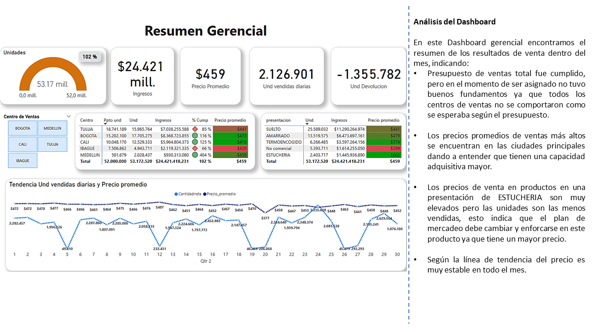
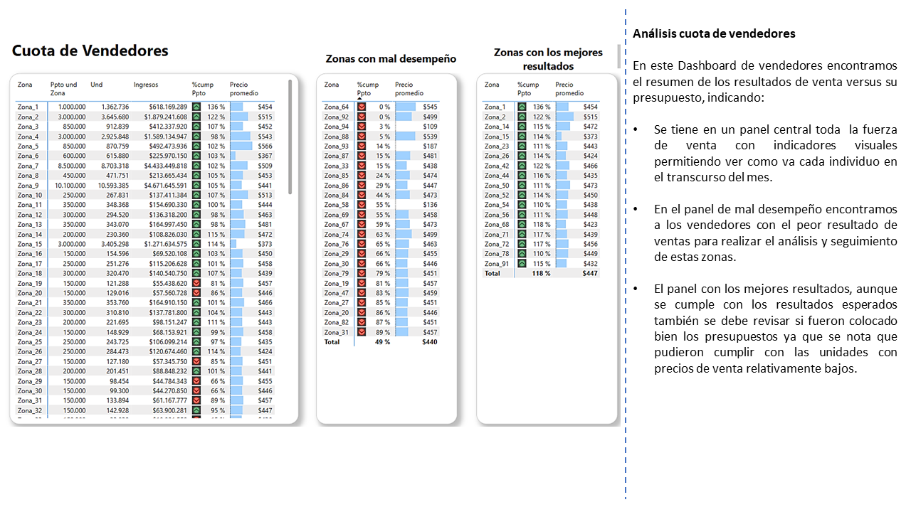
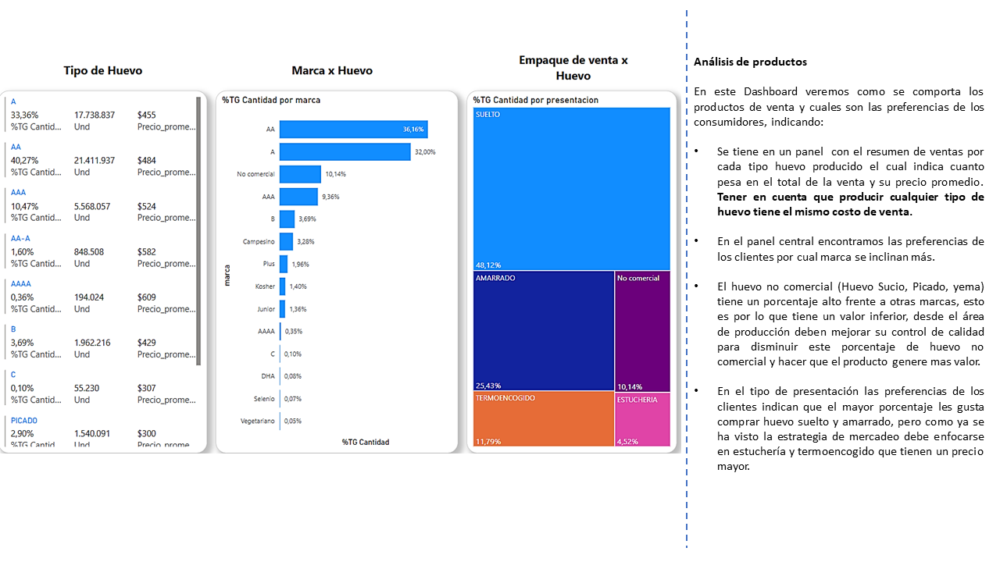
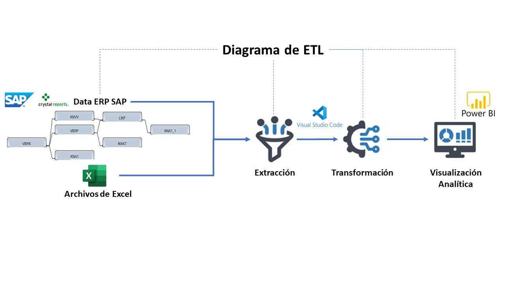

<h1 style="text-align: center;">
<strong>Primera entrega del proyecto</strong>
</h1>
<h2 style="text-align: center;">
Universidad Autónoma de Occidente
</h2>
<h3 style="text-align: center;">
Maestría en Inteligencia Artificial y Ciencia de Datos
</h3>
<h3 style="text-align: center;">
Asignatura: Aprendizaje Automático
</h3>
<h3 style="text-align: center;">
Profesor: Francisco Jose Mercado Rivera, PhD
</h3>
<h3 style="text-align: center;">
10 de mayo de 2025
</h3>

---

## Autores:

<div align="center">

| Juan David Díaz Calero |  Luis Carlos Correa Zuluaga   |      Carlos Becerra       |
| :--------------------: | :---------------------------: | :-----------------------: |
|     Cód. 22502473      |         Cód. 22501541         |       Cód. 22500215       |
| juan.diaz_c@uao.edu.co | luis_carlos.correa@uao.edu.co | carlos.becerra@uao.edu.co |

</div>

---

## Estructura del Proyecto

```
ETL_PROYECTO/
├── codigo/                     # Scripts de transformación y verificación
│   ├── transformar.py
│   └── verificar.py
│
├── datos/
│   ├── originales/             # Datos desde el ERP SAP
│   │   └── FLASH BI.xlsx
│   └── transformados/         # Datos Limpios y transformados
│       └── flash_bi_limpio.csv
│
├── presupuestos/              # Archivos con presupuestos de ventas
│   ├── PPTO_DISTRITOS.xlsx
│   └── PPTO_zona.xlsx
│
├── Visualizacion/             # Dashboard en Power BI
│   └── dashboard ventas.pbix
│
├── principal.py               # Script principal
├── README.md                  # Documentación general
└── requisitos.txt             # Dependencias
```

---

## Requisitos

Para ejecutar este proyecto necesitas tener instalado:

- Python 3.10 o superior
- pandas
- openpyxl

Instala los paquetes con:

```bash
pip install -r requisitos.txt
```

---

## Exploración inicial de los datos

Se realizo una exploración inicial de los datos disponibles relacionados con la fuerza de ventas y su desempeño a medir, encontrado diferentes archivos de Excel no estandarizados donde se llevan los presupuestos de los vendedores y se revisa en SAP las diferentes tablas donde posiblemente se pueda extraer la información para realizar el informe.

### Fuentes de Datos Identificadas:

1. Archivos Excel de la Fuerza de Ventas: Archivos donde se encuentran sus presupuestos de ventas, por cliente, producto, canal de distribución y centro logístico.
2. ERP SAP R/3 Se identifican las siguientes tablas:

_Tablas con información de clientes_

- KNA1: Datos generales del maestro de clientes (nombre, Nit o cedula del cliente, dirección, teléfono).
- KNVV: Información específica de ventas del cliente (Tipo de cliente, a que canal de distribución pertenece, zona de ventas, vendedor condiciones de pago).

_Tabla con información de los productos_

- MAKT: Descripciones de los productos.

_Tablas con información de la facturación_

- VBRK: Datos de cabecera de las facturas (fechas, cliente, destinatario, canal de distribución, totales).
- VBRP: Datos de posición de las facturas (cantidad, producto, descuentos precio).
- LIKP: Datos de cabecera de los documentos de entrega (fechas y números de entrega).

## Proceso ETL

### 1. Extracción

Para la extracción directa desde SAP utilizaremos la herramienta con la que cuenta la empresa SAP Crystal Reports, permite consultar varias tablas al mismo tiempo de SAP y crear modelos relacionales entre ellas.

La información generada puede descargarse en formato en XLS, XLSX o CSV.

La extracción de datos mediante Crystal Reports se realizará mediante una carga incremental diaria, permitiendo la actualización continua sin duplicar registros innecesarios.

Archivos Excel: Consolidación de los presupuestos para ser comparables con la venta real realizada en el mes.

- Archivo fuente: `FLASH BI.xlsx`

### 2. Transformación

La transformación de datos se realizará en dos etapas. Primero, en SAP Crystal Reports, se organizarán y relacionarán las tablas extraídas del ERP para estructurar la información de manera coherente. Luego, en Python, se aplicarán procesos de limpieza, estandarización y consolidación para garantizar la calidad de los datos antes de pasarlos a Power BI.

Estos son los procesos que se realizaran:

1. Organización en Crystal Reports: Se estructurará la relación de las tablas de SAP y generando el siguiente modelo relacional.
2. Limpieza de datos en Python: Se eliminarán valores nulos, registros duplicados y datos inconsistentes para mejorar la calidad del análisis.
3. Estandarización de formatos: Se unificarán las estructuras de datos provenientes de Excel y Crystal Reports, asegurando consistencia en nombres de columnas, formatos de fechas, montos y códigos de identificación.
4. Automatización del proceso: Se desarrollarán scripts en Python que permitirán programar la transformación de datos, asegurando que la información se procese de manera eficiente y replicable en cada actualización.
5. Protección de la información confidencial: Para proteger la información confidencial, se desarrollará un script en Python que reemplazará los nombres de clientes con identificadores genéricos (Cliente 1, Cliente 2...), además de renombrar zonas de ventas y canales de distribución para garantizar la privacidad de la información.

- `nomb_solicitante` a Cliente_1, Cliente_2, etc.
- `zona_de_ventas` a Zona_1, Zona_2, etc.
- `canal_dist` a Canal_1, Canal_2, etc.

#### 2.1 Validación de Datos

Para asegurarnos de que los datos sean confiables antes de integrarlos en Power BI, realizaremos varias validaciones clave:

1. Revisión de consistencia: Compararemos los datos transformados con el reporte de ventas de ese mes para verificar que la información extraída desde SAP y los archivos Excel coincida con indicadores como ventas totales, cantidad de unidades vendidas y cantidad de clientes facturados.
2. Verificación de claves únicas: Nos aseguraremos de que los identificadores de clientes, productos y vendedores sean correctos y estén correctamente relacionados en todas las tablas.
3. Detección de valores inusuales: Usaremos Python para identificar posibles errores en los datos, como precios de venta fuera del rango esperado o nombres de productos que no correspondan a la misma categoría.
4. Protección de datos confidenciales: Usaremos Python para revisar que los nombres de los clientes, zonas de ventas y canales de distribución hayan sido reemplazados correctamente por identificadores genéricos (Cliente 1, Cliente 2...).
5. Automatización de la validación: Implementaremos scripts en Python para que estos controles se realicen automáticamente en cada actualización de datos.
6. Notificación de errores detectados: Se generará un reporte automático que documentará cualquier anomalía encontrada en los datos, permitiendo su corrección antes de la carga en Power BI.

Con estas validaciones, nos aseguramos de que la información en Power BI sea precisa y confiable, facilitando el análisis y la toma de decisiones estratégicas.

### 3. Carga

- Exportación del resultado a `flash_bi_limpio.csv`

---

## Lógica de Anonimización

Para proteger la información confidencial, los nombres reales fueron reemplazados por identificadores genéricos.

---

## Visualización

El archivo `dashboard ventas.pbix` contiene resumen gerencial de ventas, cumplimientos de zonas de ventas , Graficas con comportamiento de los productos ofrecidos.




---

## Control de Calidad

El script `verificar.py` valida:

- Ausencia de nulos
- Formato correcto
- No duplicados

---

## Diagrama del Pipeline ETL



---

## Ejecución

Para correr el ETL:

```bash
python principal.py
```
